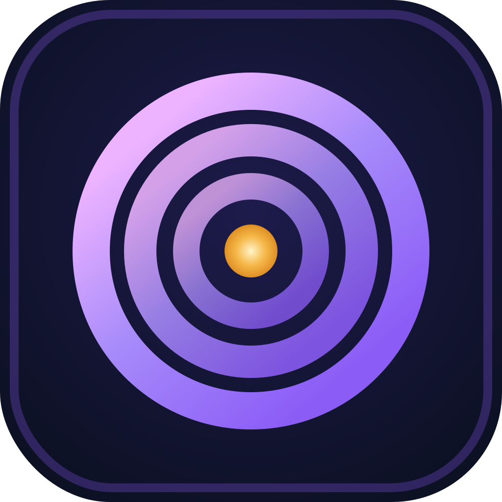

<p align="center">
  
</p>

<h1 align="center">Aria Focus</h1>

<p align="center">
  A private, offline focus-music player for Windows, with a built-in AI Music Studio.<br>
  No account. No subscription. No telemetry.
</p>

<p align="center">
  <a href="https://github.com/zanganeh/aria-focus/actions/workflows/ci.yml"></a>
  <a href="LICENSE-MIT"></a>
  
  
</p>

Aria Focus is a standalone desktop app for deep work, motivation, creativity,
learning, and light work. It plays integrity-checked music from local storage,
keeps preferences and session history on the device, and presents a deliberately
small activity-first interface. The optional **AI Music Studio** generates short
instrumental tracks entirely on your machine.

The project is open for source review and contribution. The application is at a
stable 0.22.0 source version. Signed, reviewed public installers remain gated on
the protected release workflow below; this README does not claim signing or
final review has already happened.

## What it includes

- One-click activity tiles for five kinds of focus session
- Play, pause, previous, next, volume, favourites, and keyboard media controls
- Infinite, countdown, and work/break interval timers
- Per-activity intensity, genre, and mood preferences
- Local session history and independent focus/enjoyment feedback
- Fully offline playback after content installation
- Optional **AI Music Studio** for locally generated instrumental tracks
- Strict manifest, hash, codec, path, and installed-tree validation
- Safe startup recovery without silently deleting user data

## Why it is different

Aria Focus is not a streaming service. There is no account system, cloud library,
advertising, behavioural analytics, or recurring payment. Music and settings stay
on the computer. Bundled content has explicit provenance, technical analysis, and
human-review gates before it can become a public release.

Aria Focus is not medical treatment and does not claim to diagnose or treat ADHD.
It is an independent project and is not affiliated with any named third-party
focus-music product or service.

## Install and use

Aria Focus runs on **Windows 11 x64**.

1. Download the latest installer from the
   [Releases page](https://github.com/zanganeh/aria-focus/releases).
   Prefer a signed release when one is available. Unsigned source-only builds are
   clearly labelled and are not official releases.
2. Run the downloaded setup file. Windows SmartScreen may warn for unsigned
   builds; check `SHA256SUMS` on the release page before running an unsigned
   installer.
3. Open Aria Focus, choose a focus activity, optionally pick a genre and mood,
   choose a timer, and press Play. Everything stays on your device.

Offline playback works after the content library is installed. No network
connection is needed for listening or for generation once the Music Studio runtime
is installed.

## AI Music Studio

The AI Music Studio is a first-class feature. It lets you describe the music you
want in simple terms—an activity, a sound style, an energy level, and an optional
note—and generates a short instrumental track **locally on your device**. Nothing
is uploaded, and no account is required.

### Minimum requirements

The packaged Music Studio runtime bundles its own private Python environment,
pinned source, dependencies, and model snapshots. **You do not need to
separately install Python, `uv`, Git, FFmpeg, or any model weights**—the app
checks your hardware, downloads the signed runtime once, and then runs offline.

| Requirement      | Minimum                                                    |
| ---------------- | ---------------------------------------------------------- |
| Operating system | Windows 11 x64                                             |
| Architecture     | x64 (`x86_64`)                                             |
| System RAM       | 16 GiB                                                     |
| GPU              | NVIDIA CUDA GPU with at least 8 GiB VRAM                   |
| Free disk        | About 14.2 GB for the public runtime, plus a safety margin |

The current generation worker uses CUDA. On devices that do not meet these
requirements, the Studio reports what it detected and what is missing instead of
starting a generation that cannot succeed.

### One-click setup

1. Open **My Music** → **Music Studio**. The app inspects your device and shows
   the detected hardware, the minimum requirements, and the disk space needed.
2. If setup is required, press **Set up Music Studio**. The app verifies the
   signed package manifest and signature, then copies the runtime. No shell
   commands are run and no arbitrary packages are installed.
3. When setup is complete, choose a sound style, energy, and length, then
   **Generate music**. Preview, save to My Music, regenerate, or discard.

### What is bundled

- A private, self-contained Python runtime (no system Python is used).
- Pinned source code and pinned dependencies for the local generator.
- Immutable model snapshots with recorded provenance.
- An Ed25519-signed package manifest so the app can verify integrity and
  authenticity before and after install.

### Offline and privacy

After the one-time setup, generation runs entirely on your device. Generated
tracks, requests, and feedback are stored locally and are clearly separated from
reviewed bundled content. The app does not send prompts, audio, or usage data to
any server.

### Generation length

Each generated track is either **90 seconds** or **180 seconds** of seamless
instrumental audio, ready to loop for a focus session.

### Troubleshooting

- **"Set up Music Studio" fails during download:** check free disk space (about
  14.2 GB plus margin) and your network during the one-time download, then retry.
  Setup is resumable.
- **"Music Studio is not supported on this device":** the app detected that your
  GPU, VRAM, or RAM is below the minimum. The message lists what was detected and
  what is required. Generation needs an NVIDIA CUDA GPU with at least 8 GiB VRAM.
- **Setup reports a verification error:** the signed manifest or runtime did not
  match. Do not run an unverified runtime; re-run setup or download the package
  again from the pinned release.
- **Generation is busy:** only one track is generated at a time. Wait for the
  current track to finish, then generate another.

See [`tools/music-generation/README.md`](tools/music-generation/README.md) for the
maintainer-side production and conversion tools.

## Build from source

### Requirements

- Windows 11 x64
- Node.js 24.11 or newer
- pnpm 10.10
- Rust 1.92 with the MSVC toolchain
- Visual Studio 2022 Build Tools with Desktop C++ support
- Microsoft Edge WebView2 Runtime

The exact verified development environment is recorded in
[`docs/windows-preflight.md`](docs/windows-preflight.md).

### Development app

```powershell
git clone https://github.com/zanganeh/aria-focus.git
cd aria-focus
pnpm install --frozen-lockfile
pnpm tauri dev
```

A normal clone intentionally contains no production music pack, model weights,
or large Music Studio runtime. Source builds use a procedural development sound
until separately reviewed content is staged.

### Quality checks

```powershell
pnpm verify
cargo fmt --all -- --check
cargo clippy --workspace --all-targets -- -D warnings
cargo test --workspace
python scripts/check_repository_hygiene.py
```

### Source-only Windows installer

```powershell
pnpm tauri build
```

The resulting NSIS and MSI packages appear under `target/release/bundle/`. They
do not contain the official reviewed music library and are not official releases.

## Music and local generation

Official music is distributed separately from Git because audio binaries are
large and require their own provenance and review lifecycle. Release builds pin
the exact archive name and SHA-256, validate a closed-world manifest, and bundle
only approved assets.

The AI Music Studio is the optional user-facing generation path described above.
Generated tracks remain local and are clearly separated from reviewed bundled
content.

## Repository map

| Path                         | Purpose                                                       |
| ---------------------------- | ------------------------------------------------------------- |
| `apps/desktop`               | React interface and Tauri desktop host                        |
| `crates/audio-engine`        | Native playback, decoding, looping, DSP, and volume           |
| `crates/catalogue`           | Strict content manifests, imports, and track selection        |
| `crates/domain`              | Session state machine and timers                              |
| `crates/persistence`         | SQLite preferences, history, registry, and migrations         |
| `crates/music-studio-domain` | Local-generation job and validation model                     |
| `tools`                      | Content analysis, ingest, candidate ledger, and music tooling |
| `docs`                       | Architecture, product, safety, content, and release evidence  |

Start with [`docs/architecture.md`](docs/architecture.md) for system boundaries and
[`docs/product-spec.md`](docs/product-spec.md) for product behaviour.

## Releases

GitHub Actions performs ordinary CI on every pull request. Pushing a stable
`vMAJOR.MINOR.PATCH` tag automatically starts a separate, protected release
workflow that:

1. checks out an existing version tag;
2. downloads the exact pinned reviewed-library archive;
3. verifies repository hygiene, content, frontend, and Rust tests;
4. builds NSIS and MSI installers;
5. submits them to SignPath for Windows signing;
6. verifies Authenticode signatures and creates `SHA256SUMS`; and
7. uploads the signed files to a draft GitHub release.

The release remains a draft until a maintainer completes the Windows install and
upgrade matrix. The release-tag validator accepts only canonical stable tags and
rejects prerelease suffixes. See [`docs/releases.md`](docs/releases.md) and
[`docs/content-pack-upgrades.md`](docs/content-pack-upgrades.md).

Signed draft creation is automatic after a stable version tag is pushed and the
protected environment is approved. Publishing that draft remains an explicit
maintainer decision. Signing, the reviewed-library archive, and the Music Studio
runtime are protected gates; this README does not claim they are already complete.

## Contributing

Contributions are welcome. Please read [`CONTRIBUTING.md`](CONTRIBUTING.md) before
opening a pull request. Keep changes focused, add tests for behaviour changes, and
never commit generated music, models, runtimes, installers, credentials, or local
agent output.

For vulnerabilities, follow [`SECURITY.md`](SECURITY.md) and use a private GitHub
security advisory instead of a public issue.

## Licence and trademarks

Source code is available under your choice of
[MIT](LICENSE-MIT) or [Apache-2.0](LICENSE-APACHE). Contributions are accepted
under the same terms.

The Aria Focus name, ripple mark, wordmark, and branded installer presentation are
not licensed for use by modified distributions. Forks may use the source under its
open-source licence but must adopt their own name, package ID, icon, and branding.
See [`TRADEMARKS.md`](TRADEMARKS.md), [`ASSETS.md`](ASSETS.md), and
[`THIRD_PARTY_NOTICES.md`](THIRD_PARTY_NOTICES.md).

Created by **Aria Zanganeh** and Aria Focus contributors.
