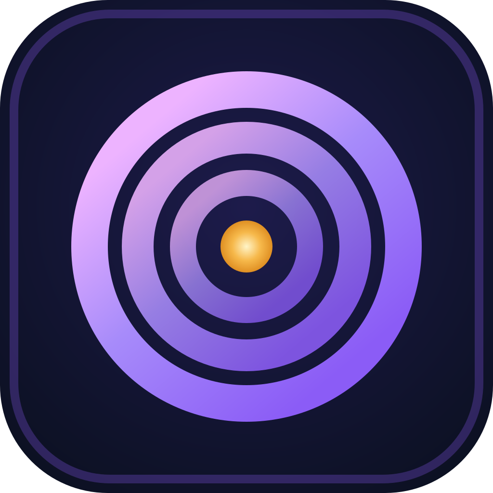

<p align="center">
  
</p>

<h1 align="center">Aria Focus</h1>

<p align="center">
  A free, open-source, offline focus-music app with a built-in AI Music Studio.<br>
  No account. No subscription. No telemetry.
</p>

<p align="center">
  <a href="https://github.com/zanganeh/aria-focus/actions/workflows/ci.yml"></a>
  <a href="https://github.com/zanganeh/aria-focus/actions/workflows/unsigned-release.yml"></a>
  <a href="LICENSE-MIT"></a>
  
  <a href="https://github.com/zanganeh/aria-focus/releases"></a>
</p>

<p align="center">
  <a href="https://github.com/zanganeh/aria-focus/releases/latest/download/aria-focus-windows-x86_64-setup.exe">🪟 Windows</a>
  ·
  <a href="https://github.com/zanganeh/aria-focus/releases/latest/download/aria-focus-macos-aarch64.dmg">🍎 macOS Apple Silicon</a>
  ·
  <a href="https://github.com/zanganeh/aria-focus/releases/latest/download/aria-focus-macos-x86_64.dmg">🍎 macOS Intel</a>
</p>

Aria Focus is a standalone desktop app for the broad focus-music use case—deep work, motivation, creativity,
learning, and light work. It plays integrity-checked music from local storage,
keeps preferences and session history on the device, and presents a deliberately
small activity-first interface. The optional **AI Music Studio** generates short
instrumental tracks entirely on your machine; its [metadata-driven prompt
system](docs/music-prompt-system.md) is documented for reproducible R&D.

The project is open for source review and contribution. GitHub Actions builds and
publishes release assets; this repository does not rely on locally built installers.
Stable release packages are unsigned and built by GitHub Actions. The unsigned
release workflow downloads the approved music library archive, verifies its
SHA-256, and embeds it in the Windows and macOS installers. Source-only builds
remain available for inspection and development.

## Download from GitHub Releases

<p>
  <a href="https://github.com/zanganeh/aria-focus/releases/latest/download/aria-focus-windows-x86_64-setup.exe">📦 Windows installer</a>
  ·
  <a href="https://github.com/zanganeh/aria-focus/releases/latest/download/aria-focus-macos-aarch64.dmg">📦 macOS Apple Silicon DMG</a>
  ·
  <a href="https://github.com/zanganeh/aria-focus/releases/latest/download/aria-focus-macos-x86_64.dmg">📦 macOS Intel DMG</a>
</p>

The links above always target the newest non-preview GitHub release. The current
stable packages are unsigned; verify `SHA256SUMS` and download only from this
official repository. Preview builds are clearly marked, and ordinary CI artifacts
remain source-only inspection builds rather than releases.

## What it includes

- One-click activity tiles for five kinds of focus session
- Play, pause, previous, next, volume, favourites, and keyboard media controls
- Infinite, countdown, and work/break interval timers
- Per-activity intensity, genre, and mood preferences
- Local session history and independent focus/enjoyment feedback
- Fully offline playback after content installation
- Optional **AI Music Studio** for locally generated instrumental tracks
- Strict manifest, hash, codec, path, and installed-tree validation
- Safe startup recovery without silently deleting user data

## Why it is different

Aria Focus is not a streaming service. There is no account system, cloud library,
advertising, behavioural analytics, or recurring payment. Music and settings stay
on the computer. Bundled content has explicit provenance, technical analysis, and
human-review gates before it can become a public release.

Aria Focus is not medical treatment and does not claim to diagnose or treat ADHD.
It is an independent project and is not affiliated with any named third-party
focus-music product or service.

## Install and use

Aria Focus has packages for **Windows 11 x64** (MSI and NSIS) and **macOS** (DMG
containing an app bundle) for both **Apple Silicon/aarch64** and
**Intel/x86_64**. Stable release packages are produced by GitHub Actions only.
The current stable release is unsigned; signing and notarization will be added
later without changing the download links.

When a stable release has been published, use the download area above.

1. Download the appropriate package from the
   [Releases page](https://github.com/zanganeh/aria-focus/releases).
   Windows releases provide MSI and NSIS installers; macOS releases provide a
   DMG. The current stable release is unsigned, so verify `SHA256SUMS` before
   opening it and expect a security warning from the operating system.
2. On Windows, run the downloaded setup file. On macOS, open the DMG and drag
   Aria Focus to Applications. Unsigned builds may require an explicit macOS
   Privacy & Security approval.
3. Open Aria Focus, choose a focus activity, optionally pick a genre and mood,
   choose a timer, and press Play. Everything stays on your device.

Offline playback works after the content library is installed. No network
connection is needed for listening or for generation once the Music Studio runtime
is installed.

### If all activity tiles are disabled after an update

This means startup integrity recovery found a problem in installed content. In
current releases, legacy pre-release registry records named
`local-activity-library-v<decimal>` are retired automatically: their files are
kept under the closed-world safety audit, but they are excluded from playback.
Your preferences, feedback, and session history do not need to be deleted.

Close and reopen the app, then confirm that the current stable installer was
downloaded from [GitHub Releases](https://github.com/zanganeh/aria-focus/releases)
and that its `SHA256SUMS` entry matches. If the issue remains, open **Settings**
and include the displayed startup error, app version, and operating system in a
bug report. Maintainers should follow the upgrade matrix in
[`docs/content-pack-upgrades.md`](docs/content-pack-upgrades.md); a clean install
alone is not sufficient release evidence.

## AI Music Studio

The AI Music Studio is a first-class feature with two clear generation paths:

- **Offline Local Studio** runs the reviewed local runtime on supported Windows/NVIDIA
  hardware. Prompts and audio stay on the device after the one-time runtime setup.
- **Optional OpenRouter Cloud Studio** is available from **Create** when you want
  higher-end hosted music generation. You provide your own OpenRouter key in
  **Settings**, then choose an audio model, number of tracks, duration, and a hard
  maximum budget. The app reads the selected models' current OpenRouter pricing,
  calculates the minimum for the whole batch, and lets you generate one, five,
  ten, twenty-five, or up to 100 candidate tracks.

Cloud generation is paid online work. The app shows an estimate and asks for
confirmation before submitting; the provider's final usage is reconciled against
the budget, and a batch that cannot be validated is never activated. As a current
reference, OpenRouter lists Lyria 3 Pro Preview at **$0.08 per full-length song**;
prices and model availability can change, so treat the in-app estimate as the
source of truth. Your key is stored in the operating-system credential store,
never in app preferences or generated prompts. Normal listening remains offline,
and the previous activated library can be restored from Settings.

For either path, the prompt system uses activity, genre, mood, tempo, instrument
roles, arrangement, evolution, and locked exclusions such as instrumental-only,
no speech/lyrics, no jazz, and an intro under ten seconds. The advanced controls
show the exact prompt and generation choices. No Aria Focus account is required.

### Minimum requirements

The packaged Music Studio runtime bundles its own private Python environment,
pinned source, dependencies, and model snapshots. **You do not need to
separately install Python, `uv`, Git, FFmpeg, or any model weights**—the app
checks your hardware, downloads the signed runtime once, and then runs offline.

| Requirement      | Minimum                                                    |
| ---------------- | ---------------------------------------------------------- |
| Operating system | Windows 11 x64                                             |
| Architecture     | x64 (`x86_64`)                                             |
| System RAM       | 16 GiB                                                     |
| GPU              | NVIDIA CUDA GPU with at least 8 GiB VRAM                   |
| Free disk        | About 14.2 GB for the public runtime, plus a safety margin |

The current generation worker uses CUDA and is **Windows/NVIDIA-only**. macOS
packages do not bundle a Music Studio runtime unless a separate macOS runtime is
created and reviewed. On devices that do not meet these
requirements, the Studio reports what it detected and what is missing instead of
starting a generation that cannot succeed.

### One-click setup

1. Open **Create** → **Music Studio**. The app inspects your device and shows
   the detected hardware, the minimum requirements, and the disk space needed.
2. If setup is required, press **Set up Music Studio**. This is the one-time
   internet step: the app verifies the
   signed package manifest and signature, then copies the runtime. No shell
   commands are run and no arbitrary packages are installed.
3. When setup is complete, choose a genre, mood, speed/tempo, duration, and
   energy, then
   **Generate music**. Preview, save to My Music, regenerate, or discard.

### Optional OpenRouter setup

1. Open **Settings** → **OpenRouter**.
2. Paste an OpenRouter API key and press **Validate and save key**. The key is
   checked before it is stored in the operating-system credential store; it is
   never printed, placed in SQLite, or bundled into a release.
3. Open **Create**. Choose the audio model, track count, activities, duration,
   optional prompt refinement and cover art, then review the displayed estimate.
   The minimum budget is recalculated whenever these choices change; you can
   raise it to set your own maximum.
4. Confirm the paid batch. Tracks are generated sequentially, decoded and
   hashed locally. After every track passes validation, preview the candidates
   in the app and press **Save and activate tracks** when you are satisfied.
   Nothing replaces the current library before that explicit save action. If a
   provider returns an invalid model, insufficient credits, rate limit, timeout,
   or malformed media, the app shows a safe actionable message and keeps the
   previous offline library.

Cloud generation is intentionally opt-in. Removing the key disables future
cloud requests but does not remove already downloaded tracks. Use **Restore
previous cloud library** if a newly activated batch is not useful.

### Test-only mock generation

To test the Create screen, background progress, preview, and activation flow
without contacting OpenRouter or spending credits, build the desktop app with
the explicit Rust feature `cloud-generation-mock`:

```powershell
pnpm -C apps/desktop tauri dev --features cloud-generation-mock
```

The mock uses a local fixture audio file and local SVG covers, reports zero
cost, and is disabled in the default development build and all release builds.
It is a compile-time test feature rather than a user setting; never enable it
when producing a release installer.

### What is bundled

- A private, self-contained Python runtime (no system Python is used).
- Pinned source code and pinned dependencies for the local generator.
- Immutable model snapshots with recorded provenance.
- An Ed25519-signed package manifest so the app can verify integrity and
  authenticity before and after install.

### Offline and privacy

After the one-time setup, generation runs entirely on your device. Generated
tracks, requests, and feedback are stored locally and are clearly separated from
reviewed bundled content. The app does not send prompts, audio, or usage data to
any server.

### Generation length

Each generated track is either **90 seconds** or **180 seconds** of seamless
instrumental audio, ready to loop for a focus session.

### Troubleshooting

- **"Set up Music Studio" fails during download:** check free disk space (about
  14.2 GB plus margin) and your network during the one-time download, then retry.
  Setup is resumable.
- **"Music Studio is not supported on this device":** the app detected that your
  GPU, VRAM, or RAM is below the minimum. The message lists what was detected and
  what is required. Generation needs an NVIDIA CUDA GPU with at least 8 GiB VRAM.
- **Setup reports a verification error:** the signed manifest or runtime did not
  match. Do not run an unverified runtime; use **Retry setup** in Music Studio to
  resume or repair the local runtime, or download the package again from the
  pinned release.
- **Generation is busy:** only one track is generated at a time. Wait for the
  current track to finish, then generate another.

See [`tools/music-generation/README.md`](tools/music-generation/README.md) for the
maintainer-side production and conversion tools.

## Build from source

### Requirements

- Windows 11 x64
- Node.js 24.11 or newer
- pnpm 10.10
- Rust 1.92 with the MSVC toolchain
- Visual Studio 2022 Build Tools with Desktop C++ support
- Microsoft Edge WebView2 Runtime

The exact verified development environment is recorded in
[`docs/windows-preflight.md`](docs/windows-preflight.md).

### Development app

```powershell
git clone https://github.com/zanganeh/aria-focus.git
cd aria-focus
pnpm install --frozen-lockfile
pnpm tauri dev
```

A normal clone intentionally contains no production music pack, model weights,
or large Music Studio runtime. Source builds use a procedural development sound
until separately reviewed content is staged.

### Quality checks

```powershell
pnpm verify
cargo fmt --all -- --check
cargo clippy --workspace --all-targets -- -D warnings
cargo test --workspace
python scripts/check_repository_hygiene.py
```

### Source-only desktop packages

```powershell
pnpm tauri build
```

The resulting NSIS and MSI packages appear under `target/release/bundle/` on
Windows. On macOS, use `pnpm tauri build --config
src-tauri/tauri.macos.conf.json` on the matching Apple Silicon or Intel runner to
produce an `.app` and `.dmg` under the macOS bundle directories. These
source-only packages contain neither the official reviewed music library nor the
Windows-only Music Studio runtime, and are not official releases.

## Music and local generation

Official music is distributed separately from Git because audio binaries are
large and require their own provenance and review lifecycle. Release builds pin
the exact archive name and SHA-256, validate a closed-world manifest, and bundle
only approved assets.

The AI Music Studio is the optional user-facing generation path described above.
Generated tracks remain local and are clearly separated from reviewed bundled
content.

## Repository map

| Path                         | Purpose                                                       |
| ---------------------------- | ------------------------------------------------------------- |
| `apps/desktop`               | React interface and Tauri desktop host                        |
| `crates/audio-engine`        | Native playback, decoding, looping, DSP, and volume           |
| `crates/catalogue`           | Strict content manifests, imports, and track selection        |
| `crates/domain`              | Session state machine and timers                              |
| `crates/persistence`         | SQLite preferences, history, registry, and migrations         |
| `crates/music-studio-domain` | Local-generation job and validation model                     |
| `tools`                      | Content analysis, ingest, candidate ledger, and music tooling |
| `docs`                       | Architecture, product, safety, content, and release evidence  |

Start with [`docs/architecture.md`](docs/architecture.md) for system boundaries and
[`docs/product-spec.md`](docs/product-spec.md) for product behaviour.

## Releases

GitHub Actions performs ordinary CI on every pull request. The current simple
path is **Actions → Unsigned stable release → Run workflow**. It chooses a stable
`vMAJOR.MINOR.PATCH` tag and a source ref (normally `main`), downloads and
verifies the approved unsigned music library, builds packages with that library,
and publishes the release without requiring signing credentials.

The later protected path is **Actions → Signed public release → Run workflow**.
After every protected gate passes, GitHub Actions creates the tag and starts the
release workflow that:

1. checks out the selected source ref;
2. downloads the exact pinned reviewed-library archive;
3. verifies repository hygiene, content, frontend, and Rust tests;
4. builds the signed Windows NSIS and MSI installers and signed/notarized macOS
   DMGs for Apple Silicon and Intel;
5. submits Windows installers to SignPath and signs/notarizes macOS DMGs with
   Apple Developer credentials;
6. verifies Authenticode and macOS signatures, validates the notarization ticket,
   and creates `SHA256SUMS`; and
7. uploads the signed files to a draft GitHub release.

The release remains a draft until a maintainer completes the Windows install and
upgrade matrix. The release-tag validator accepts only canonical stable tags and
rejects prerelease suffixes. See [`docs/releases.md`](docs/releases.md) and
[`docs/content-pack-upgrades.md`](docs/content-pack-upgrades.md).

The signed repository workflow performs the build, Windows and macOS signing,
notarization, checksums, and draft-release upload. For a manual run, it creates
the stable tag only after all protected gates pass. The `publish_release`
checkbox can publish the verified draft after all assets are uploaded; otherwise
the draft remains available for final manual testing. It needs the documented
reviewed-library, SignPath, and Apple Developer secrets/variables configured in
GitHub. Signing, the reviewed-library archive, the Music Studio runtime, and
updater metadata are protected gates; this README does not claim they are
already complete. See
[`docs/releases.md`](docs/releases.md) for updater signing setup.

## Contributing

Contributions are welcome. Please read [`CONTRIBUTING.md`](CONTRIBUTING.md) before
opening a pull request. Keep changes focused, add tests for behaviour changes, and
never commit generated music, models, runtimes, installers, credentials, or local
agent output.

For vulnerabilities, follow [`SECURITY.md`](SECURITY.md) and use a private GitHub
security advisory instead of a public issue.

## Licence and trademarks

Source code is available under your choice of
[MIT](LICENSE-MIT) or [Apache-2.0](LICENSE-APACHE). Contributions are accepted
under the same terms.

The Aria Focus name, ripple mark, wordmark, and branded installer presentation are
not licensed for use by modified distributions. Forks may use the source under its
open-source licence but must adopt their own name, package ID, icon, and branding.
See [`TRADEMARKS.md`](TRADEMARKS.md), [`ASSETS.md`](ASSETS.md), and
[`THIRD_PARTY_NOTICES.md`](THIRD_PARTY_NOTICES.md).

Created by **Aria Zanganeh** and Aria Focus contributors.
